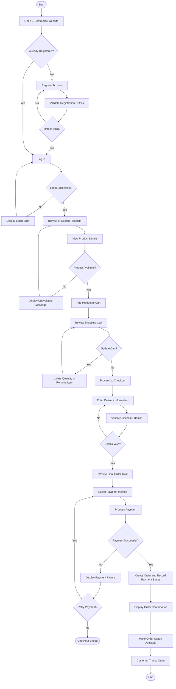

# Business Process Flow — E-Commerce System

## 1. Purpose

This document describes the customer journey through the proposed e-commerce system, from account access and product discovery to order placement and order tracking.

It defines the main workflow, decision points, business rules, and exception scenarios to help stakeholders, developers, and QA testers understand the expected business process.

## 2. Process Scope

**Process Name:** Customer Purchase and Order Management

**Primary Actor:** Customer

**Supporting Systems:** E-Commerce System, Payment Gateway, Order Management Module

**Trigger:** A customer decides to purchase a product.

**Expected Outcome:** The customer can place an order, receive confirmation after successful order placement, and view the available order status.

## 3. Business Process Flow Diagram

The following Mermaid diagram illustrates the proposed end-to-end customer purchase process.

## 4. Detailed Process Steps

| Step | Activity                   | Actor or System | Expected Result                                                               |
| ---- | -------------------------- | --------------- | ----------------------------------------------------------------------------- |
| 1    | Open the website           | Customer        | E-commerce homepage is displayed.                                             |
| 2    | Register or log in         | Customer        | Customer account is created or accessed.                                      |
| 3    | Validate account details   | System          | Valid information is accepted; invalid information is rejected with feedback. |
| 4    | Search or browse products  | Customer        | Relevant products are displayed.                                              |
| 5    | View product details       | Customer        | Product information, price, and availability are displayed.                   |
| 6    | Add products to cart       | Customer        | Selected products are added to the shopping cart.                             |
| 7    | Review the cart            | Customer        | Selected items, quantities, and order total are displayed.                    |
| 8    | Proceed to checkout        | Customer        | Checkout process begins.                                                      |
| 9    | Enter delivery information | Customer        | Required delivery details are provided.                                       |
| 10   | Validate checkout details  | System          | Valid information is accepted.                                                |
| 11   | Review final order total   | Customer        | Customer can review the amount before payment.                                |
| 12   | Select payment method      | Customer        | A supported payment method is selected.                                       |
| 13   | Process payment            | Payment Gateway | Payment result is returned to the system.                                     |
| 14   | Handle payment result      | System          | Successful and failed payments are handled appropriately.                     |
| 15   | Confirm order              | System          | Order confirmation is displayed after successful order placement.             |
| 16   | Track order                | Customer        | Customer can view the available order status.                                 |

## 5. Business Rules

* Customers must provide valid information to register an account.
* Customers must authenticate before accessing account-specific functionality.
* Product availability must be checked before an order is placed.
* The shopping cart must reflect the selected products and quantities.
* The system must calculate the order total according to the defined pricing rules.
* Required checkout information must be validated before payment.
* Payment results must be handled according to the payment gateway's response.
* An order must not be incorrectly marked as paid when payment has failed.
* The system must display order confirmation after successful order placement.
* Customers must be able to view the order status permitted by the system.
* Administrative functions must be restricted to authorized users.

## 6. Exception Handling

| Scenario                                 | Expected System Response                                                                 | Business Importance     |
| ---------------------------------------- | ---------------------------------------------------------------------------------------- | ----------------------- |
| Invalid registration information         | Display validation messages and request corrections.                                     | Data accuracy           |
| Incorrect login credentials              | Deny access and display an appropriate error.                                            | Account security        |
| Product unavailable                      | Inform the customer and allow further browsing.                                          | Inventory accuracy      |
| Invalid delivery information             | Highlight missing or invalid fields.                                                     | Order accuracy          |
| Payment failure                          | Display the failure and provide an appropriate retry option.                             | Payment reliability     |
| Payment response is delayed or uncertain | Verify the transaction status before attempting another charge or confirming payment.    | Avoid duplicate charges |
| Order confirmation fails to display      | Preserve accurate order and payment records and provide a way to check the order status. | Customer confidence     |
| Unauthorized administrative access       | Deny access to restricted functionality.                                                 | Security                |

## 7. Business Analyst Responsibilities

The Business Analyst is responsible for:

1. Understanding stakeholder needs and documenting business requirements.
2. Mapping the customer purchase journey.
3. Identifying business rules and decision points.
4. Documenting normal and exception scenarios.
5. Defining expected system responses.
6. Preparing user stories and acceptance criteria.
7. Supporting requirement clarification with developers and QA testers.
8. Preparing UAT scenarios to validate the agreed requirements.
9. Maintaining consistency between the process flow, functional requirements, and test cases.

## 8. Related Project Documents

* [Project Overview](01_Project_Overview.md)
* [Stakeholder Analysis](02_Stakeholder_Analysis.md)
* [Business Requirements](03_Business_Requirements.md)
* [Functional Requirements](04_Functional_Requirements.md)
* [User Stories](06_User_Stories.md)
* [Acceptance Criteria](07_Acceptance_Criteria.md)
* [Gap Analysis](09_Gap_Analysis.md)
* [UAT Test Cases](10_UAT_Test_Cases.md)
* [Requirements Traceability Matrix](11_Requirements_Traceability_Matrix.md)

## 9. Expected Outcome

This process flow provides a shared understanding of the proposed e-commerce customer journey. It supports requirement validation, development planning, exception handling, and UAT preparation.

**Project Status:** Proposed process documented. Implementation and validation against a working application are pending.
